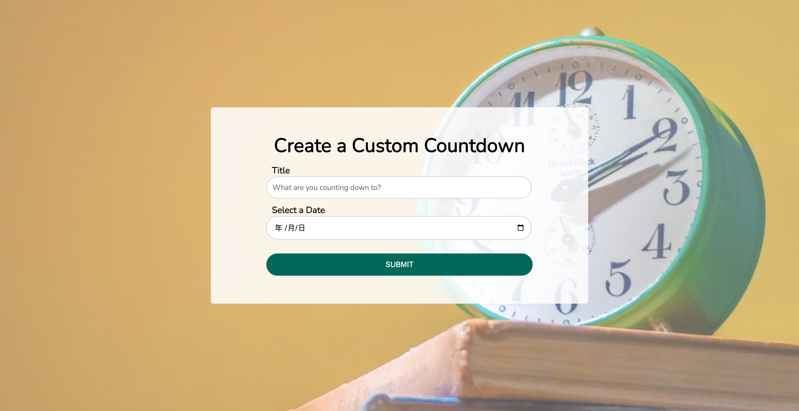

This Custom Countdown App built with HTML, CSS, JavaScript.

## Table of contents

- [Overview](#overview)
  - [Screenshot](#screenshot)
  - [Links](#links)
- [My process](#my-process)
  - [Built with](#built-with)
- [Author](#author)

## Overview

Users should be able to:

- Users can choose a title and a date for this countdown app.
- Countdown panel shows the remaining time to the users.
- Countdown time is stored in the local storage within the browser.

### Screenshot

### Links

- Live Site: [Click here](https://simpleluke.github.io/Custom-Countdown/)

### Built with

- HTML
- CSS
- JavaScript

## Author

- Website - [Luke Lai](https://lukelai.tech/)
- LinkedIn - [Luke Lai](https://www.linkedin.com/in/luke-lai-309a3522b/)
- Twitter - [@LukeLaiDev](https://www.twitter.com/LukeLaiDev)
